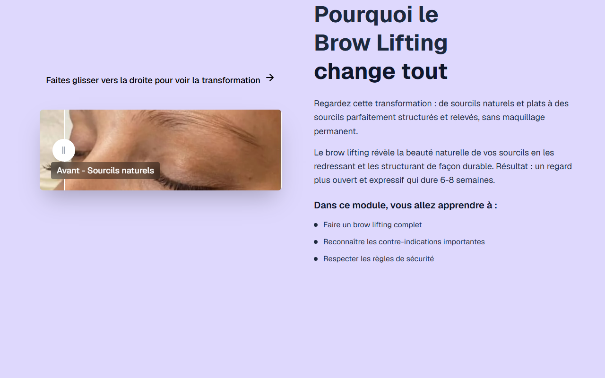

# Intro Slider — Brow Lift & Lamination

**Course:** Brow lift & Lamination  
**Slide:** 1  
**Live URL:** https://brow-lift.edtechiecorp.com  
**Stack:** Next.js · Tailwind CSS · TypeScript · GitHub Pages  

## What this slide does

Opening intro slider for the Brow Lift & Lamination course, presenting the course title, objectives, and a visual overview of the brow lamination technique. It sets the learner's expectations for the module and introduces the key outcomes they will achieve by the end of the course.

## Screenshot

## Usage

This slide is embedded as an iframe inside Coassemble at the live URL above. DNS is managed via Cloudflare (`edtechiecorp.com`). To update the slide, push to the `main` branch — GitHub Actions will rebuild and redeploy automatically.
